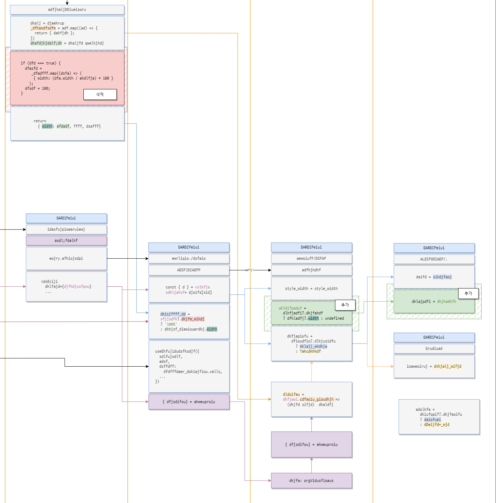

* toc
{:toc}

## A24_00000 테스트잡
(시작일자: 2024.00.00, 예상종료일자: ----.--.--, 실제종료일자: ----.--.--)

---

### 업무 내용:

  - full_width 적용하지 않은 경우: 기존 5.0 에서 정상작동함
  - full_width 적용한 경우: 설정한 컬럼 너비의 합 이하로도 grid가 줄어드는 기존 5.0 오류가 있음
  - **따라서 full_width 가 true인 경우**, 설정한 컬럼 너비의 합 이하로 줄어들지 않도록 min_width를 설정함

### 개발지연사유:

  - 9/13 (+0.3) [진행상태 5.0 UI] action_data null로 들어오는 문제 수정 \
  - 9/13 (+0.2) [3.0 바닥 공통 수정] onMessageHandler 수정 건 관련 질답

\

