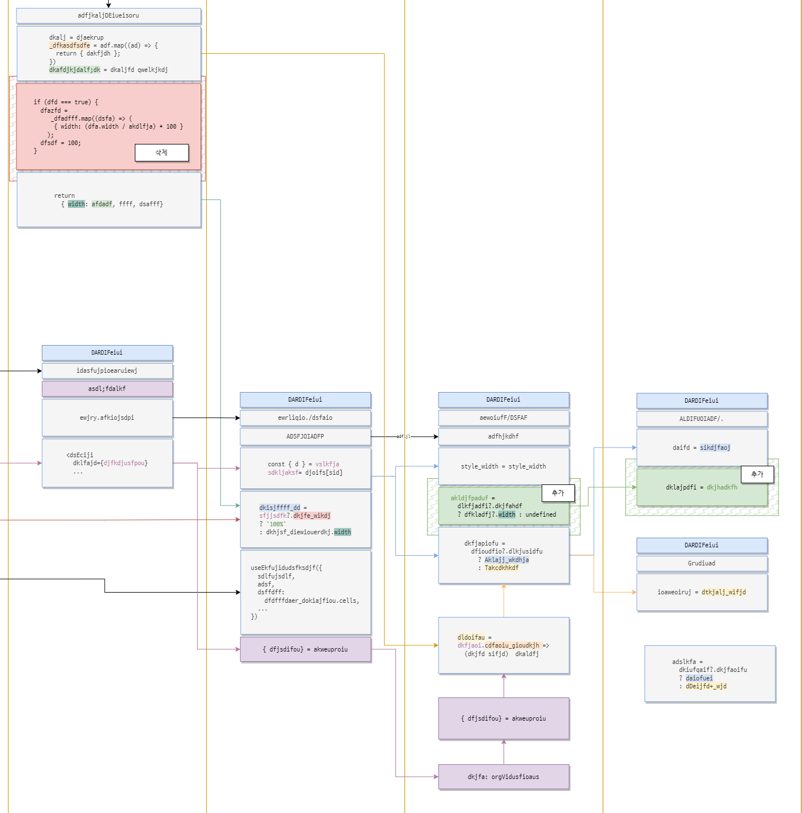
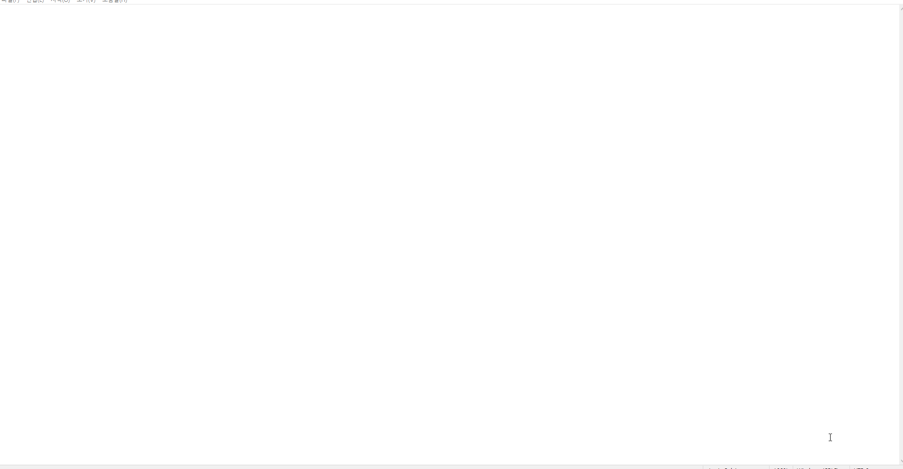

* toc
{:toc}

### [진행완료]

-

### [진행중]

A24_00000 테스트잡 \
(시작일자: 2024.09.12, 예상종료일자: 2024.09.20, 실제종료일자: ----.--.--)

- 업무 내용:

  1. 이러할 경우, 이렇게 되도록
  2. 재고 어쩌구
  3. 메뉴 어트리뷰트
  4. 5.0 코드 변경

- 9/13 잡 미완료

A24_00001 테스트잡이지롱22 \
(시작일자: 2024.09.12, 예상종료일자: 2024.09.20, 실제종료일자: ----.--.--)

- 업무 내용:

  - 이러할 경우, 5.0
  - lorem ipsum lorem ipsum lorem ipsum lorem ipsum lorem ipsum lorem ipsum lorem ipsum 

- 개발지연사유:\
   9/13 (+0.3) [문제1] 들어오는 문제 수정 \
   9/13 (+0.2) [문제2-2] 질답

### [진행예정]

- 없음

\

